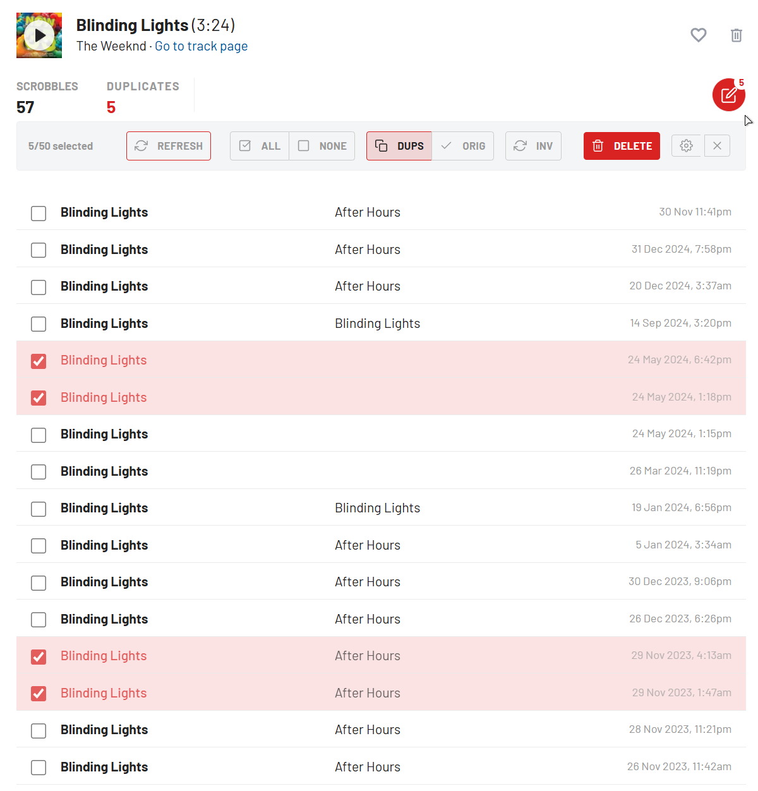
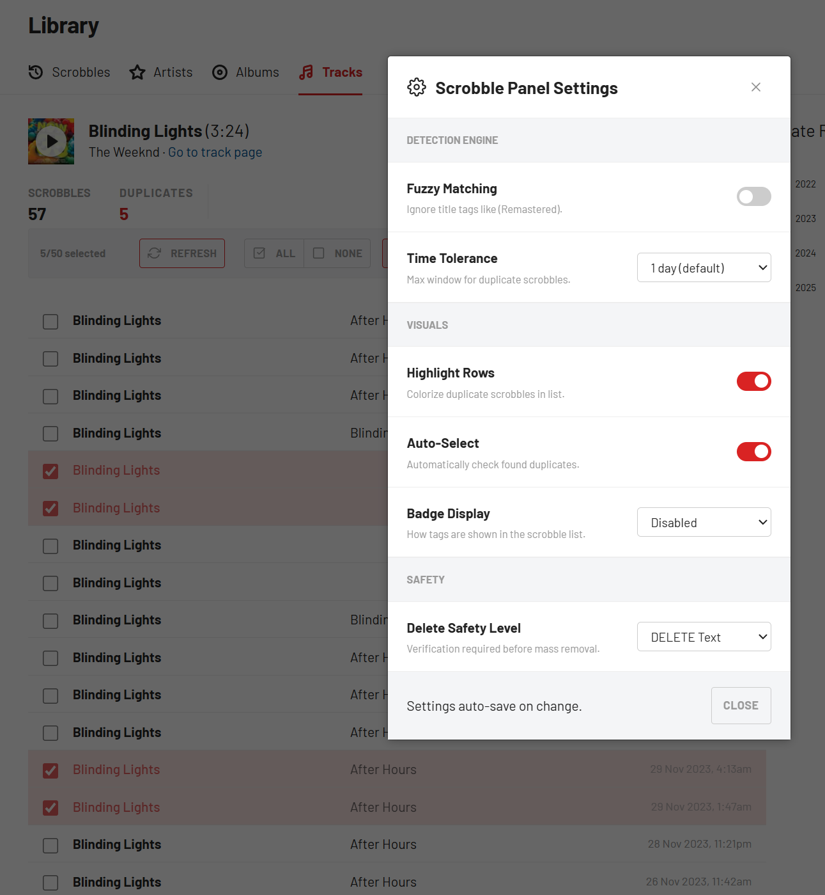
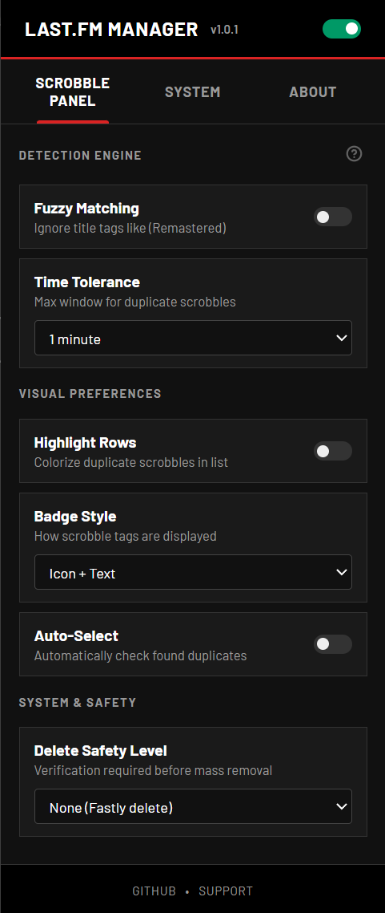
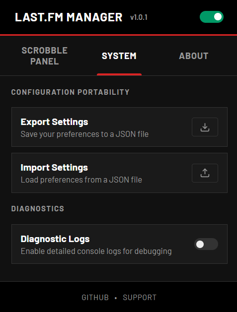
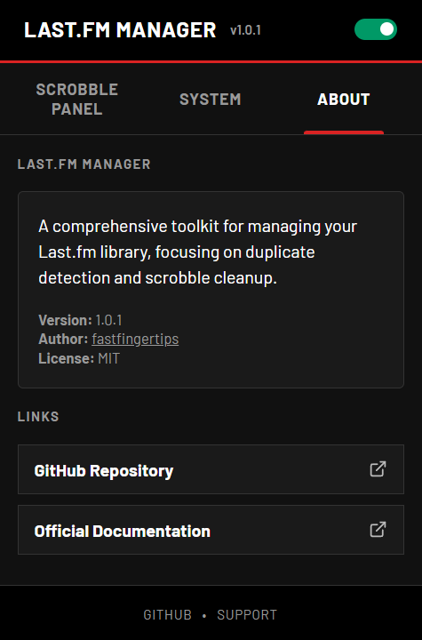

# Last.fm Manager

Premium library management toolkit for Last.fm — streamlining duplicate detection, daily navigation, and history cleanup.

## Screenshots

| Scrobble Panel | Settings Panel |
|:---:|:---:|
|  |  |

| Main Interface | System Preferences | About & Version |
|:---:|:---:|:---:|
|  |  |  |

## Features

- **Duplicate Detection** — Fuzzy matching with configurable time tolerance (detects remasters/variants)
- **Quick Navigation** — Browse your library day-by-day with on-page buttons or Arrow keys
- **Bulk Actions** — Select and delete multiple scrobbles with one click
- **Safety Levels** — Configurable delete confirmation (Input "DELETE" word or simple alert)
- **Settings Portability** — Export/import your engine configurations as JSON
- **Dynamic UI** — Seamlessly integrates into Last.fm's native design (Dark Mode supported)

## Structure

```
src/
├── shared/     # Config, design tokens
├── content/    # Page injection scripts & styles
└── popup/      # Extension popup UI
assets/         # Screenshots and media
```

## Install

1. Clone repo
2. Chrome → `chrome://extensions` → Developer mode
3. Load unpacked → select folder
4. Go to [Last.fm Library](https://www.last.fm/user/_/library)

## License

MIT

